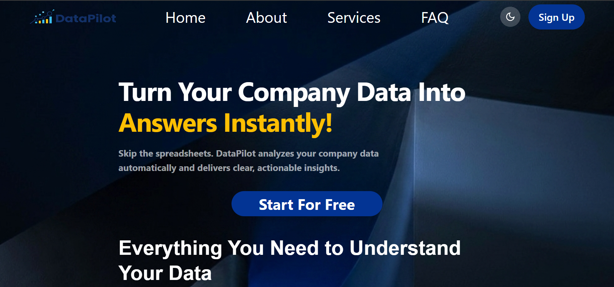
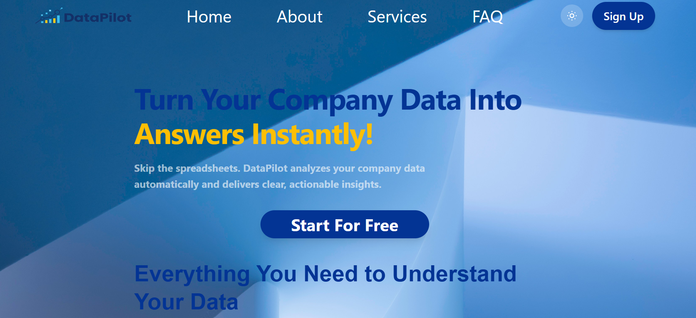

# DataPilot-landing-page
DataPilot is a modern AI-powered data analytics platform designed to help businesses turn their company data into clear, actionable insights.
This project is a responsive landing page created to showcase the DataPilot platform and its main features.

## Link of the page 
https://data-pilot-landing-page-smoky.vercel.app/

## Features
- Responsive desktop and mobile design
- Mobile navigation menu
- Hero section with call-to-action
- Data analytics services section
- Customer testimonials
- Contact section
- Responsive footer
- Modern SaaS-style UI

## Technologies
- HTML5
- Tailwind CSS
- JavaScript
- SVG

## Responsive Design
The website is designed to work across:
- Desktop
- Tablet
- Mobile

## Screen-shots
Desktop:

Mobile:

## Lighthouse Scores
- Performance: 99
- Accessibility: 100
- Best Practices: 100
- SEO: 100

## Author
Samira Hammouche